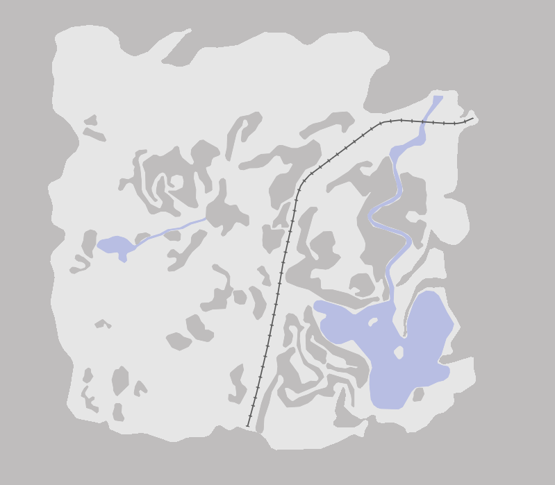

# The Long Dark Map

A work in progress web map of the various area available to play in [The Long Dark](http://intothelongdark.com/).

## Design

The map is designed in [Mapbox Studio](https://www.mapbox.com/mapbox-studio/). I'm using QGIS to create the base layers (accessible/inaccessible areas, water, boundaries, roads, rail) as shapefiles and importing them into Mapbox. POIs like shelters, areas, caves, bridges, and tunnels will be drawn as markers on the client side.

## Inspiration

I'm borrowing a lot of the boundary and POIs from [this Steam user](http://steamcommunity.com/sharedfiles/filedetails/?id=530202531). These maps are still best for reference when exploring. This is just an attempt to make a fancy zoomable version.
